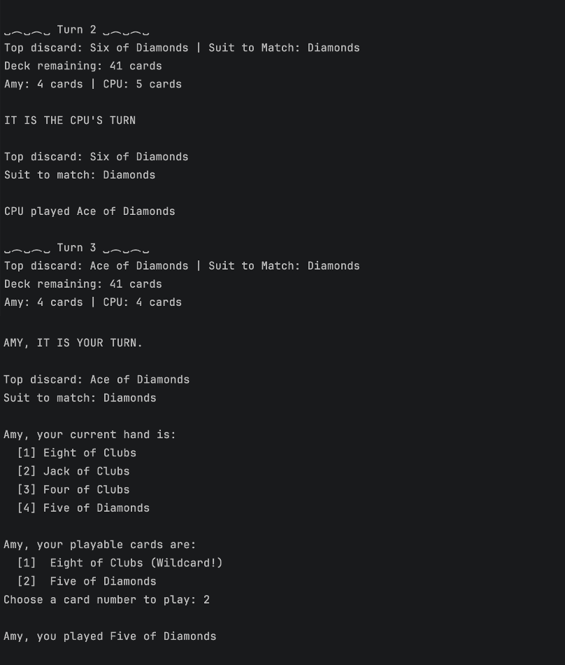
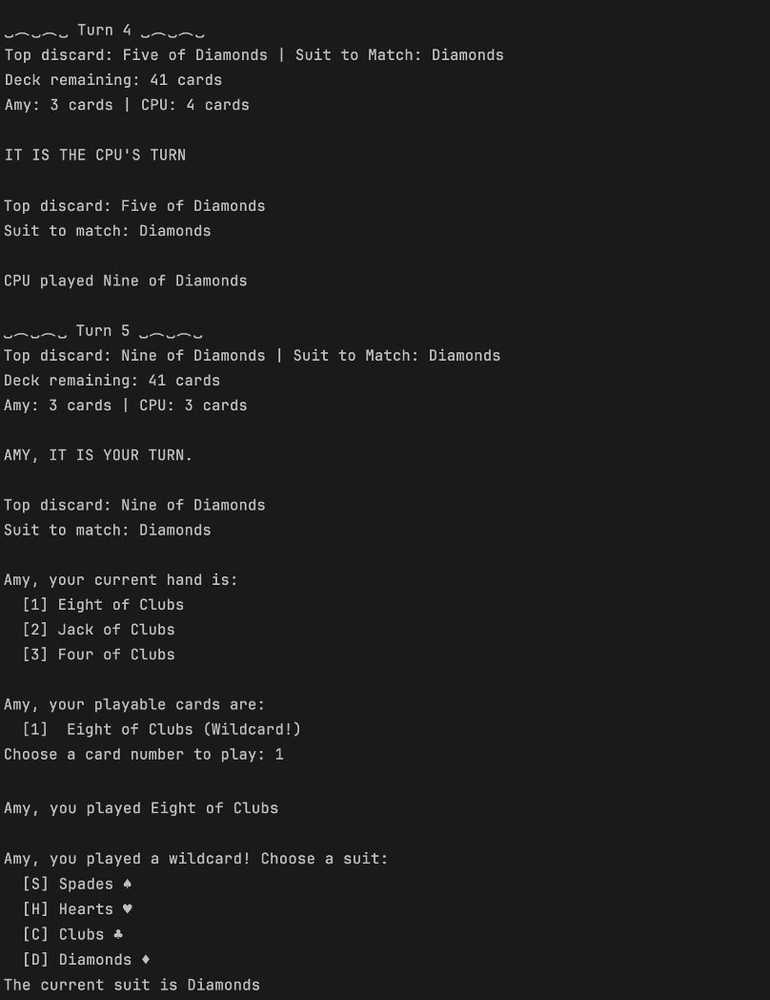
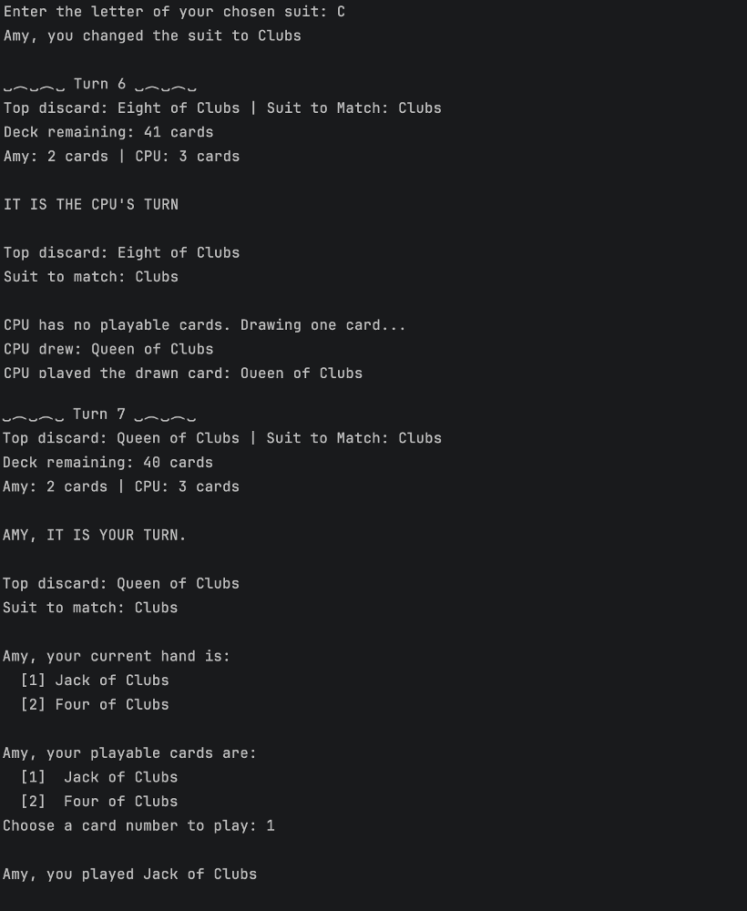
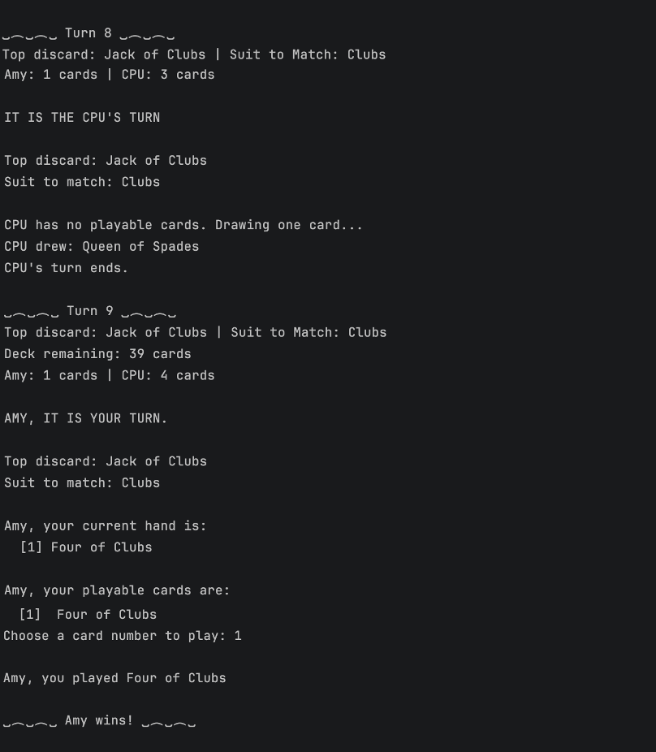

# Crazy Eights Game

## Project Description
This project implements a simple, console- based version of the game Crazy Eights. Each game is played between two players (one human and one computer) using a standard 52-card deck.

### Game Rules
- Each player starts with 5 cards.
- A card can be played if:
  - Its suit or rank matches the active suit or current rank of the top card in the discard pile, or
  - It is an Eight, which is considered a wildcard.
- When an Eight is played, the player declares the next suit.
- If a player has no playable cards, they draw one card.
- A player wins if their hand becomes empty.
- If the deck runs out, the player with the fewest cards wins.

---

## Object-Oriented Concepts Demonstrated

### Abstraction
- `ICard` defines the common behavior for all cards.
- `IPlayer` defines the common behavior for all players. 
- The game engine interacts with these interfaces as opposed to concrete implementations

### Inheritance
- `PlayerBase` provides shared logic for handling a player's hand
- `HumanPlayer` and `CpuPlayer` inherit from `PlayerBase` and implement different strategies for their respective turns. 

### Polymorphism
- All players are of type `IPlayer`
- The same game loop works on both human and computer players

### Encapsulation
- `TurnContext` only exposes the actions that a player is allowed to perform: 
  - Drawing a card
  - Playing a card
  - Declaring a suit
- Players cannot view the internal game state

---

## How to Run the Application (Console)

### Prerequisites
- .NET SDK 9.0 installed

### Steps
1. Open a terminal.
2. Navigate to the project folder that contains the `.csproj` file:

```bash
dotnet run
```
---

## Console Output






